<div align="center">

# 中国传统纹样图鉴 · Wényàng

**一个开源的中国传统纹样图录项目 —— 以美术馆图录级的审美，让传统纹样可浏览、可检索、可收藏、可使用。**

[简体中文](README.md) · [English](README.en.md) · [日本語](README.ja.md) · [한국어](README.ko.md)

[](https://wenyang.net)
[](#-路线图)
[](LICENSE)
[](LICENSE-CONTENT.md)

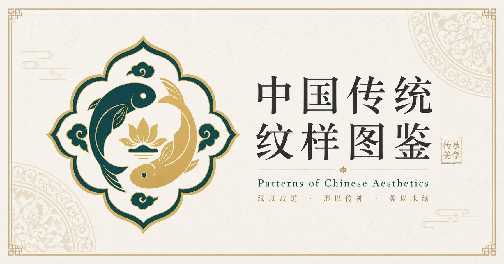

</div>

---

## 📖 目录

- [这是什么](#-这是什么)
- [为什么做这个](#-为什么做这个)
- [在线网站](#-在线网站)
- [精选预览](#-精选预览)
- [仓库结构](#-仓库结构)
- [纹样分类](#-纹样分类)
- [数据格式](#-数据格式)
- [如何使用](#-如何使用)
- [路线图](#-路线图)
- [参与共建](#-参与共建)
- [常见问题](#-常见问题)
- [许可协议](#-许可协议)
- [关于作者](#-关于作者)
- [Star History](#-star-history)
- [致谢](#-致谢)

---

## ✨ 这是什么

**中国传统纹样图鉴（Wényàng）** 是一个开放、免费、面向设计师与文化爱好者的中国传统纹样图录项目。

我们把散落在瓷器、织锦、建筑、漆器中的传统纹样，重新整理成一份**结构化、可检索**的开放素材：

- 🖼 **100 张高清纹样卡片图**（1086×1448 PNG），按 6 大类组织；
- 📝 **每张配一份纹样资料**：中文名 + 英文名、一句话简介、文化寓意、视觉关键词，以及一页中文详情（纹样构成 / 视觉特征 / 常见载体 / 色彩建议 / 现代应用 / 关联纹样 / 标签）；
- 📦 **机读数据集**：`data/patterns.json` 与 `data/patterns.csv`，汇总全部 100 条元数据，开箱即用；
- 🌐 配套在线图录站 **[wenyang.net](https://wenyang.net)**，可浏览、检索、收藏、复制配色、下载原图。

> 所有卡片图均为**原创生成与再设计**，不直接复制任何具体文物图案，可放心用于非商业的学习、研究与创作。

---

## 🎯 为什么做这个

市面上找传统纹样，常常要在「通用 AI 审美」的塑料感、低清盗图、和层层付费墙之间妥协。

**我们想做得不一样**：以**美术馆图录级**的审美，把中国传统纹样认真地整理、再设计、讲清楚——让设计师与文化爱好者能**自由地浏览、检索、收藏、复制配色并下载**这些原创再设计的纹样。

- 🎨 **审美优先** —— 图录级排版与配色，不要塑料感的「通用 AI 味」；
- 🔓 **没有付费墙** —— 开源开放，非商业自由使用；
- 📚 **有据可依** —— 不止给图，还讲寓意、构成、载体与配色；
- ♾ **长期维护** —— 100 已上线，800 规划中，700 待上线，持续生长。

---

## 🌐 在线网站

完整的浏览、检索、收藏、配色复制、原图下载体验，请访问 👉 **[wenyang.net](https://wenyang.net)**

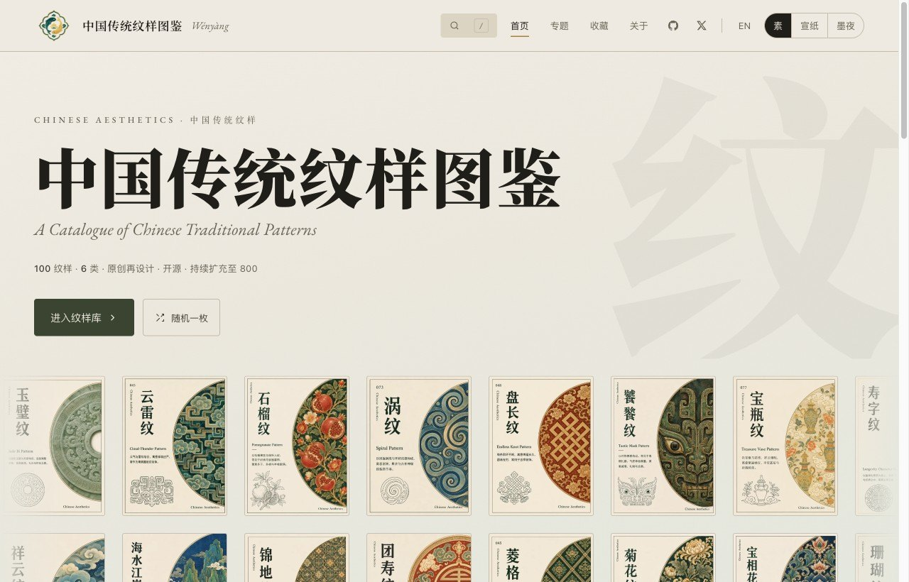

| 图库一览 | 纹样详情 |
|---|---|
| 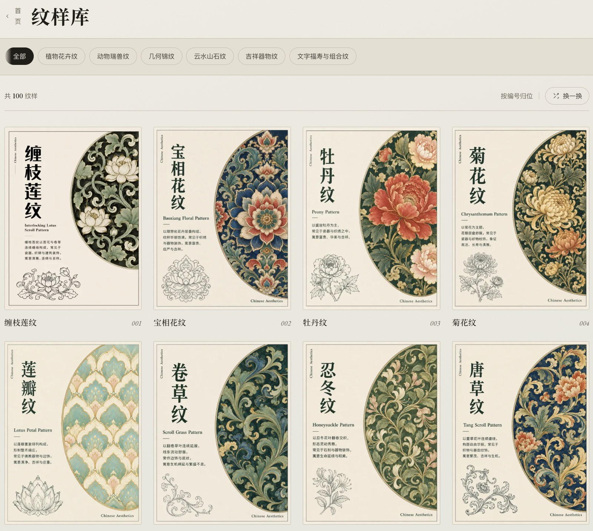 | 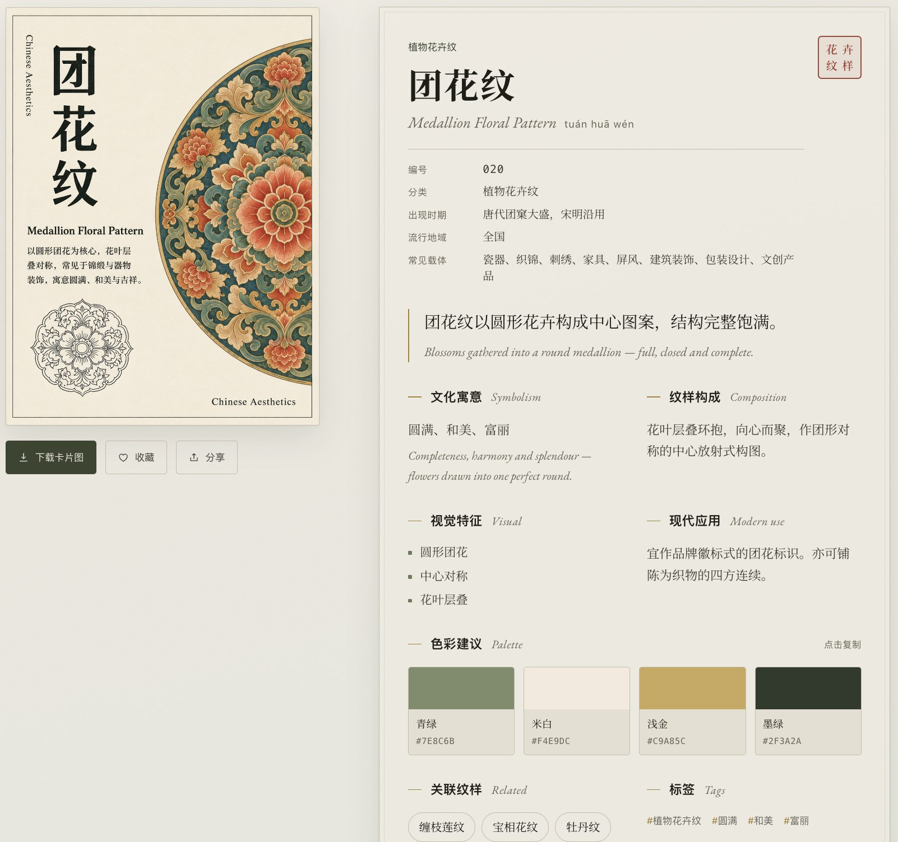 |

- 美术馆图录级审美，三套主题（素 / 宣纸 / 墨夜）；
- 桌面与移动端自适应；纯静态、零追踪（仅匿名访问统计）。

> 提示：网站上还有中英双语、时期 / 地域考据、可复制的十六进制色卡等增强信息；本仓库提供的是图库的**原始整理素材**。

---

## 🖼 精选预览

<div align="center">

| 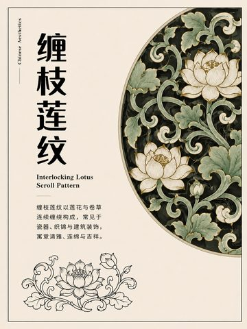<br>缠枝莲纹 | 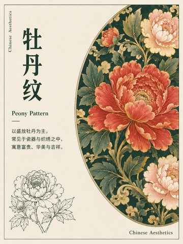<br>牡丹纹 | 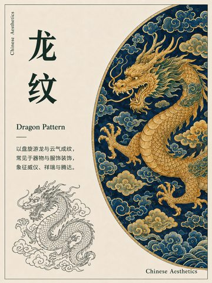<br>龙纹 | 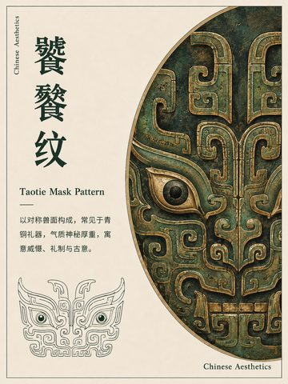<br>饕餮纹 |
|:--:|:--:|:--:|:--:|
| 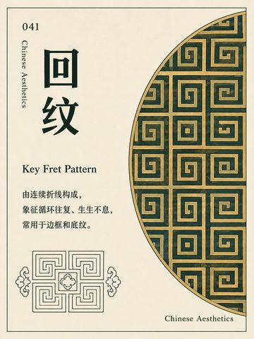<br>回纹 | 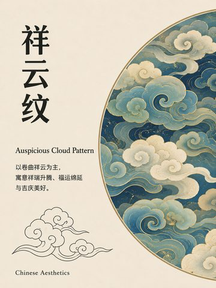<br>祥云纹 | 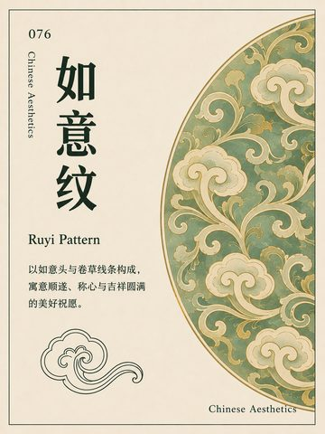<br>如意纹 | 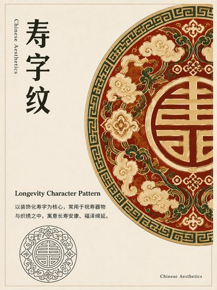<br>寿字纹 |

<sub>以上为 100 张中的 8 张 · 完整图库见 <a href="https://wenyang.net">wenyang.net</a></sub>

</div>

---

## 📁 仓库结构

```
chinese-traditional-patterns/
├── data/
│   ├── patterns.json        # 100 条元数据汇总（英文键，推荐程序读取）
│   └── patterns.csv         # 同上，表格版
├── patterns/                # 按分类组织的纹样（整理包原版）
│   ├── 001-020_植物花卉纹/
│   │   └── 001_缠枝莲纹/
│   │       ├── 001_缠枝莲纹_卡片图.png    # 高清卡片图 1086×1448
│   │       ├── 001_缠枝莲纹_详情页.md     # 中文详情页
│   │       └── 001_缠枝莲纹_meta.json     # 单条元数据
│   ├── 021-040_动物瑞兽纹/
│   ├── 041-060_几何锦纹/
│   ├── 061-075_云水山石纹/
│   ├── 076-090_吉祥器物纹/
│   └── 091-100_文字福寿与组合纹/
└── docs/                    # 网站截图与预览图
```

---

## 🗂 纹样分类

| 目录 | 分类 | Category | 数量 |
|------|------|----------|:---:|
| `001-020_植物花卉纹` | 植物花卉纹 | Flora | 20 |
| `021-040_动物瑞兽纹` | 动物瑞兽纹 | Fauna & Beasts | 20 |
| `041-060_几何锦纹` | 几何锦纹 | Geometric | 20 |
| `061-075_云水山石纹` | 云水山石纹 | Cloud · Water · Stone | 15 |
| `076-090_吉祥器物纹` | 吉祥器物纹 | Auspicious Objects | 15 |
| `091-100_文字福寿与组合纹` | 文字福寿与组合纹 | Characters & Composite | 10 |
| | **合计** | | **100** |

---

## 🔢 数据格式

每个纹样目录下有三个文件：高清卡片图 `*_卡片图.png`、中文详情页 `*_详情页.md`、元数据 `*_meta.json`。
`data/patterns.json` 则是全部 100 条 `meta` 的汇总数组，字段如下：

| 字段 | 说明 | 示例 |
|------|------|------|
| `id` | 三位编号 | `"001"` |
| `name_cn` / `name_en` | 中文名 / 英文名 | `"缠枝莲纹"` / `"Interlocking Lotus Scroll Pattern"` |
| `category` | 分类（六类之一） | `"植物花卉纹"` |
| `summary` | 一句话简介 | `"以莲花与卷曲藤蔓连续展开……"` |
| `meaning` | 文化寓意 | `"清雅、连绵、生生不息"` |
| `visual_keywords` | 视觉关键词（数组） | `["莲花","卷草","连续藤蔓","青绿白描"]` |
| `image_size` | 图片尺寸 | `"1086x1448"` |
| `card_image` / `detail_page` / `meta_json` | 三个文件的相对路径 | `"patterns/001-020_植物花卉纹/…"` |
| `batch` | 整理批次 | `"第01批_001-010_植物花卉纹"` |
| `image_sha256` | 卡片图校验值 | `"4984…fa6f"` |
| `source_note` | 素材说明 | `"原创生成与再设计，不直接复制具体文物图案。"` |

更细的解读（纹样构成 / 视觉特征 / 常见载体 / 色彩建议 / 现代应用 / 关联纹样 / 标签）见每条的 `*_详情页.md`。

---

## 🚀 如何使用

**浏览** — 直接在线访问 [wenyang.net](https://wenyang.net)，或在本仓库 `patterns/` 下按分类点开任意纹样的 `*_详情页.md` 阅读。

**下载单张图** — 进入对应纹样目录，下载 `*_卡片图.png`。

**批量 / 程序使用** — 读取 `data/patterns.json`：

```js
// 浏览器或 Node
const patterns = await fetch(
  'https://raw.githubusercontent.com/dososo/chinese-traditional-patterns/main/data/patterns.json'
).then(r => r.json());

const flora = patterns.filter(p => p.category === '植物花卉纹');
console.log(flora[0].name_cn, flora[0].name_en, flora[0].visual_keywords);
```

```python
# Python
import json, urllib.request
url = "https://raw.githubusercontent.com/dososo/chinese-traditional-patterns/main/data/patterns.json"
patterns = json.load(urllib.request.urlopen(url))
print(len(patterns), patterns[0]["name_cn"], patterns[0]["visual_keywords"])
```

> 使用须遵循 [内容许可](#-许可协议)（CC BY-NC 4.0：可自由用于非商业用途，请署名）。

---

## 🗺 路线图

这是一个**长期维护**的项目，纹样图鉴会持续扩充 —— **100 已上线 / 800 规划中 · 700 待上线，敬请期待**。

- [x] **v1 · 首发 100 条**（6 大类，高清卡片图 + 结构化资料）
- [x] 在线网站 [wenyang.net](https://wenyang.net)（检索 / 收藏 / 配色 / 下载）
- [ ] **扩充至 800 条** —— 其余约 700 条分批整理上线
- [ ] 数据集补充英文翻译、时期 / 地域考据与十六进制色卡（网站已有，逐步回流到开源数据）
- [ ] **「中国传统纹样 Skill」** —— 让 AI 助手能直接调用本图库做设计辅助与知识问答
- [ ] 更多导出格式（SVG 描边稿、配色色卡文件等）

⭐ Star 关注更新，新纹样上线第一时间知道。

---

## 🤝 参与共建

非常欢迎一起把这份图库做得更准、更全、更美！

- 🔍 **补充考据** —— 为纹样补充时期、地域、寓意的可靠来源；
- 🌏 **贡献翻译** —— 把中文资料译成英文及更多语种；
- 🎨 **贡献纹样** —— 提交新纹样（须为原创再设计、不侵权）；
- 💻 **改进工具** —— 数据校验、导出脚本、可视化等。

详见 [CONTRIBUTING.md](CONTRIBUTING.md)。提交即视为同意按本仓库许可协议授权。

> 💌 **有建议、或想一起长期维护的同道朋友**，欢迎开 [Issue](https://github.com/dososo/chinese-traditional-patterns/issues)，或在 X 上 [@thinkszyg](https://x.com/thinkszyg) 联系我。一个人能走得快，一群人能走得远。

---

## ❓ 常见问题

**Q：这些纹样图可以商用吗？**
A：内容采用 CC BY-NC 4.0，**非商业用途**可自由使用（请署名）。商业授权请联系作者。

**Q：图是直接复制文物的吗？**
A：不是。全部为**原创 AI 辅助再设计**，受传统纹样视觉语言启发，不直接复制任何具体文物或受版权保护的作品。

**Q：数据为什么以中文为主？有英文吗？**
A：名称为中英双语；详细描述目前以中文为主，**英文翻译在路线图上**。网站 [wenyang.net](https://wenyang.net) 提供更多中英双语信息。

**Q：会持续更新吗？**
A：会。这是长期项目，目标 800 条，⭐ Star 即可关注更新。

**Q：我想贡献或一起维护，怎么做？**
A：见 [参与共建](#-参与共建)，开 Issue / PR 或直接联系作者。

---

## 📜 许可协议

本仓库采用**双许可**：

- **代码 / 数据结构**（脚本、`*.json` / `*.csv` 的结构与字段组织）：[MIT](LICENSE)
- **纹样图像与文字内容**（`*.png` 卡片图、详情文案）：[CC BY-NC 4.0](LICENSE-CONTENT.md)
  —— 可自由复制、修改、再传播，**须署名**、**限非商业用途**。

如需商业授权，请通过下方渠道联系作者。

---

## 👤 关于作者

由 **爆裂队长NEXT（BLCaptain）** 独立创作与维护。

- 🌐 网站：[wenyang.net](https://wenyang.net)
- 💻 GitHub：[@dososo](https://github.com/dososo)
- 🐦 X / Twitter：[@thinkszyg](https://x.com/thinkszyg)
- ✉️ 邮箱：[blteam2026@outlook.com](mailto:blteam2026@outlook.com)

如果这个项目对你有帮助，欢迎 ⭐ Star、分享，或在 X 上 @我交流。

---

## ⭐ Star History

[](https://github.com/dososo/chinese-traditional-patterns/stargazers)

> 📈 点击查看 **[实时 Star 趋势曲线 →](https://star-history.com/#dososo/chinese-traditional-patterns&Date)**

---

## 🙏 致谢

感谢中国历代匠人留下的纹样之美。本项目以现代设计语言重新诠释传统，愿这份美得以被更多人看见、使用与延续。

<div align="center"><sub>纹脉不绝，生生不息。</sub></div>
